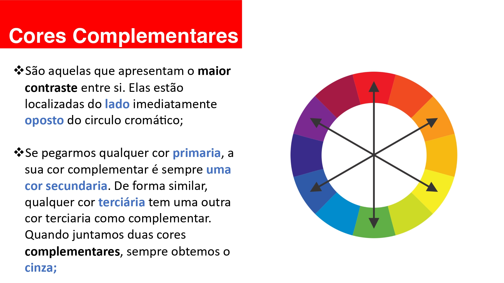
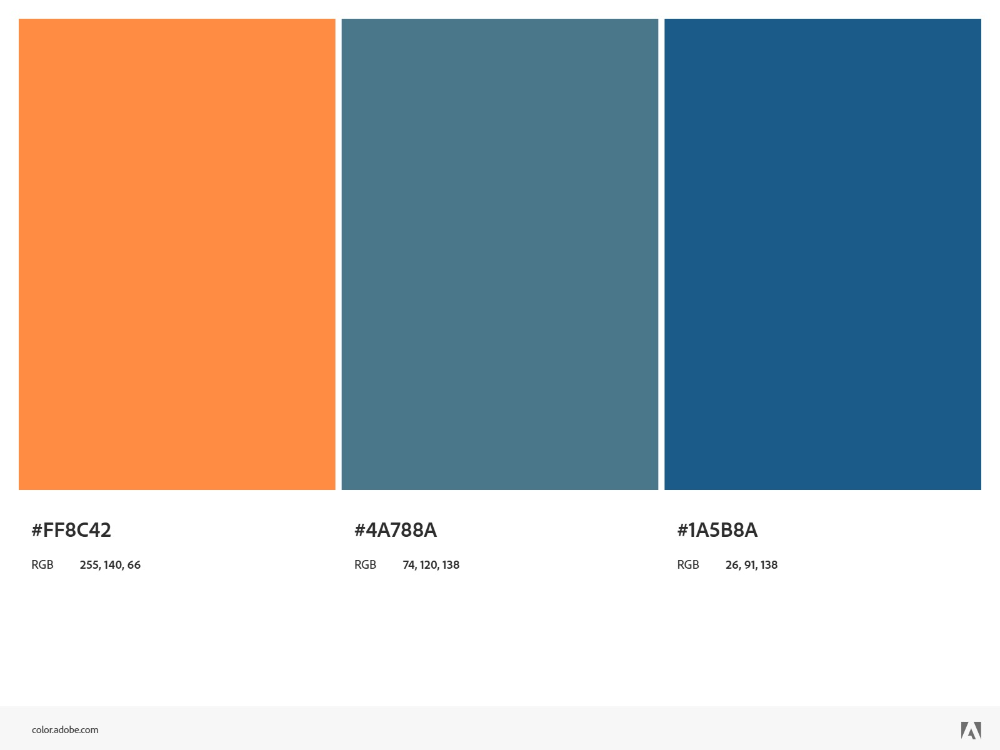

# PROJETO: Plataforma de Gerenciamento de Obras - ConstruAxis

## 🎯 Apresentação

Olá! Eu sou Jefferson Nunes e este é o projeto de uma **Plataforma Web de Gerenciamento de Obras**.

O objetivo principal é criar uma ferramenta que centralize e gerencie todas as informações críticas de um canteiro de obras, promovendo controle financeiro, logístico e de progresso.

### Visão Geral e Funcionalidades

A plataforma visa ser a espinha dorsal digital da gestão de obras, cobrindo os seguintes pontos cruciais:

* **Gestão Financeira:** Armazenamento e controle de **notas fiscais** (tanto as que já foram pagas quanto as a pagar).
* **Controle de Estoque e Logística:** Gerenciamento do **estoque de materiais**, incluindo o que foi comprado, o que foi consumido e, crucialmente, **onde foi utilizado** na obra.
* **Acompanhamento do Progresso:** Rastreamento das **etapas da obra**, permitindo visualizar o status atual de cada frente de trabalho.
* **Relatórios e Documentação (RDO):** Suporte para o preenchimento de **Relatórios Diários de Obra (RDO)** ou funcionalidades correlatas.

---
# Sobre a estrutura do projeto

Não existe um padrão definido de como estruturar um projeto front-end. Deste modo, seguiremos uma organização **modular**, visando maior **escalabilidade**. A estrutura foi desenhada para um projeto mais complexo, com várias funcionalidades, separando a organização por módulos (`assets`, `components`, `pages`).

## Princípios da divisão

### Modularidade
- Permite que o código seja dividido em **módulos independentes**, tornando cada parte mais fácil de gerenciar.

### Separação de Preocupações
- Arquivos estruturais (**HTML**), de estilo (**CSS**), de script (**JS**), e recursos (**Imagens/ícones/fontes**) são separados em pastas dedicadas (`assets`). Cada tipo de arquivo é armazenado em uma pasta de acordo com sua função no projeto.

#### Estrutura de Pastas e Arquivos

| Pasta/Arquivo | Função no Projeto |
| :--- | :--- |
| **assets/** | Agrupa **recursos globais** (estilos, scripts, imagens, etc.) |
| **components/** |Promove a **reutilização** de código e facilita a manutenção, pois módulos como cabeçalho (`header`) e rodapé (`footer`) podem ser alterados uma única vez e aplicados em diversas páginas|
| **pages/** |Separa a estrutura de cada página específica (home, about, contact), mantendo o código de cada uma organizado e isolado|
| **index.html** |É o ponto de partida do site, carregando a estrutura básica e os links para os recursos (`assets`) e componentes|
| **readme.md** | Documentação do projeto. |

### Escalabilidade
- Ao separarmos o projeto dessa maneira, fica mais fácil **adicionar novas funcionalidades** (como o módulo de Usuário, Financeiro, etc.) ou páginas sem perturbar a estrutura existente. Essa organização permite que o projeto evolua de forma controlada.

## Paleta de Cores

 
Seguindo esta lógica e usando o <a href="https://color.adobe.com/">color.adobe.com</a> foi adotada a seguinte paleta:

| Cor | Código Hexadecimal | Uso Principal e Propósito |
| :--- | :--- | :--- |
| **Azul Principal (Confiança)** | `#1A5B8A` | **Cor da Marca e Profissionalismo.** Usado em cabeçalhos, rodapés, planos de fundo escuros, tipografia principal da marca e ícones que transmitem estabilidade. |
| **Laranja de Ação (Destaque)** | `#FF8C42` | **Call-to-Action (CTA) e Alerta.** Uso exclusivo para botões primários ("Entrar", "Salvar", "Iniciar Novo Projeto"), indicadores de atenção e elementos que exigem ação imediata do usuário. |
| **Azul Secundário (Suporte)** | `#4A788A` | **Cor de Suporte e Fundo.** Usado para planos de fundo de cartões secundários, barras de navegação laterais e como cor de borda ou sombra para elementos de bloco. |
| **Cinza Neutro (Base)** | `#F8F9FA` | **Backgrounds e Legibilidade.** Fundo principal de toda a página e de grandes blocos de conteúdo. Garante que as cores de destaque se sobressaiam. |
| **Branco** | `#FFFFFF` | **Tipografia e Campos de Entrada.** Cor do texto sobre fundos escuros, fundo de cartões e áreas de input para garantir contraste máximo e limpeza. |
| **Verde (Sucesso)** | `#4CAF50` | **Feedback Positivo.** Mensagens de notificação de sucesso ("Projeto Concluído", "Salvo com Sucesso") e indicadores de status positivo. |
| **Vermelho (Perigo/Erro)** | `#DC3545` | **Feedback Negativo.** Mensagens de erro, alertas de exclusão, botões de "Cancelar" ou indicadores de status crítico. |